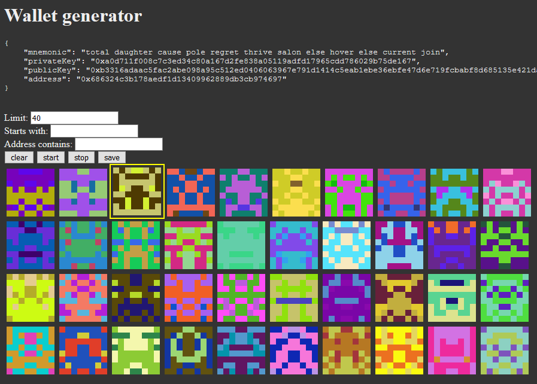

# blockie-picker

This is a quick and dirty NodeJS application that will allow you to generate ethereum wallets and select the ones with the most interesting blockies. Blockies are small icons generated by hashing a lowercase ethereum address (including the "0x" prefix). When you view an address on etherscan.io, blockies are the little icons next to the addresses. Since you cannot choose an icon for you address, this application aims to let you create an address with an icon you like.

Blockie generation in this project is possible thanks to a slightly modified version of blockies.js provided by https://github.com/ethereum/blockies.

Wallet generation code (and inspiration for the project) thanks to the https://github.com/austintgriffith/eth.build project.

## How to use

- Download the files
- Run `npm install`
- Run `npm start` or run `node server.js`
- Open your web browser to `localhost:3000`
- Select your blockie parameters
- Start
- Click on blockies that you like and save them to your locker
- View your saved blockies by visiting `localhost:3000/locker`
- If you want to use one as a wallet, all of the wallet information can be found in JSON format in your `/locker` directory